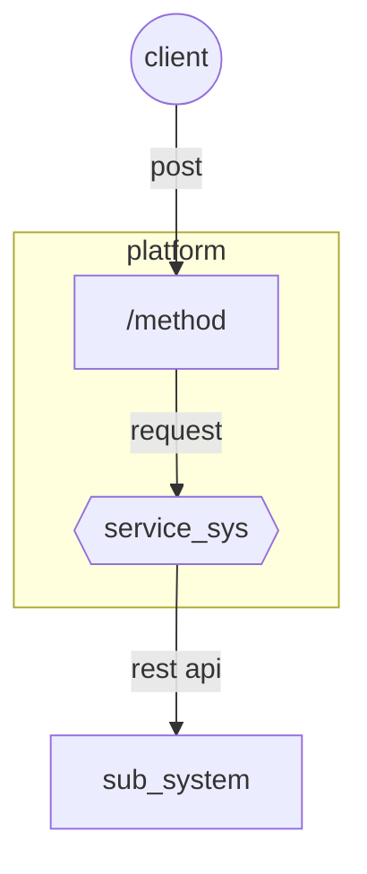

# API_NAME
<The purpose of the service is described.>

##### Connections Diagram

##### Connections info

| name                   | value                                                        |
| ---------------------- | ------------------------------------------------------------ |
| Protocol               | http                                                         |
| Namespace              | example.com                                                  |
| Host                   | 127.0.0.1                                                    |
| Port                   | 80                                                           |
| Path                   | /API_NAME/v1/                                                |
| URL RAML Design Center | [RAML](http://127.0.0.1)                                     |
| URL RAML Exchange      | [RAML](http://127.0.0.1)                                     |
| Postman                | [Collection](postman/)                                       |
| Documents              | [Documents](documents/)                                      |
| Methods                | /METHOD_NAME [ [GET](methods/methods_name/GET/apis_template.md) \|[HEAD](methods/methods_name/GET/apis_template.md) \|[POST](methods/methods_name/GET/apis_template.md) \|[PATCH](methods/methods_name/GET/apis_template.md) \|[PUT](methods/methods_name/GET/apis_template.md) \|[DELETE](methods/methods_name/GET/apis_template.md) ] |
|                        | /METHOD_NAME [ [GET](methods/methods_name/GET/apis_template.md) \|[HEAD](methods/methods_name/GET/apis_template.md) \|[POST](methods/methods_name/GET/apis_template.md) \|[PATCH](methods/methods_name/GET/apis_template.md) \|[PUT](methods/methods_name/GET/apis_template.md) \|[DELETE](methods/methods_name/GET/apis_template.md) ] |
| Databases              | [DATABASE_NAME](database/database_template.md)               |
|                        | [DATABASE_NAME](database/database_template.md)               |

## Uses Cases

This section defines the use cases related to a project and their compliance requirement.

#### METHOD_NAME

| Case                                             | method | Projects | type                          | Unitary test status                          | QA test Status                               | comments or considerations |
| ------------------------------------------------ | ------ | -------- | ----------------------------- | -------------------------------------------- | -------------------------------------------- | -------------------------- |
| [1](usescases/project_name/usescase_template.md) | GET    | example  | Prepay/Postpay/Recharge/other | <successful or failed or stopped or on hold> | <successful or failed or stopped or on hold> |                            |

## Service Information

| Details           | Data         |
| ----------------- | ------------ |
| **Projects**      | data, promo, |
| **Project Lead**  |              |
| **Provider**      |              |
| **SOA Architect** |              |

## API Changes History

| Branch     | Date | Project | Responsible | Comment |
| ---------- | ---- | ------- | ----------- | ------- |
| [master]() |      |         |             |         |
|            |      |         |             |         |
|            |      |         |             |         |
|            |      |         |             |         |
