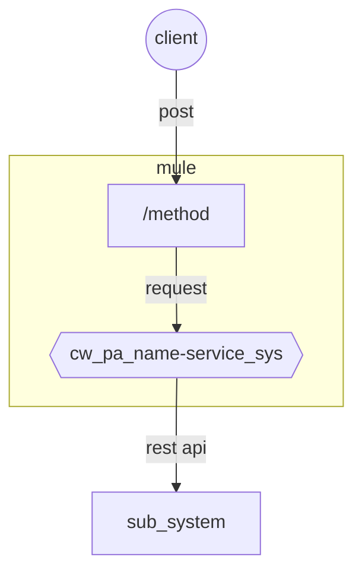

# API_NAME
Description API

##### Connections Diagram

##### Connections info

| name      | value                                              |
| --------- | -------------------------------------------------- |
| Namespace | data.com                                           |
| Protocol  | http                                               |
| Host      | 127.0.0.1                                          |
| Port      | 0000                                               |
| Path      | /API_NAME/v1/                                      |
| Methods   | [/METHOD_NAME](methods/methods_name/apis_template) |
|           | [/METHOD_NAME](methods/methods_name/apis_template) |
| Databases | [/DATABASE_NAME](database/database_template)       |
|           | [/DATABASE_NAME](database/database_template)       |

## Service Information

| Details           |      |
| ----------------- | ---- |
| **Projects**      |      |
| **Project Lead**  |      |
| **Provider**      |      |
| **SOA Architect** |      |

## Changes History

| Branch | Date | Project | Responsable | Comment |
| ------ | ---- | ------- | ----------- | ------- |
|        |      |         |             |         |
|        |      |         |             |         |
|        |      |         |             |         |
|        |      |         |             |         |

## Dependencies

no se espesifica hasta el metodo

| Legacy  Type | Description    | URI  Development           | System | Timeout |
| ------------ | -------------- | -------------------------- | ------ | ------- |
| Service      | Queue tracking | http://127.0.0.1:0000/data | test   | 60000   |

