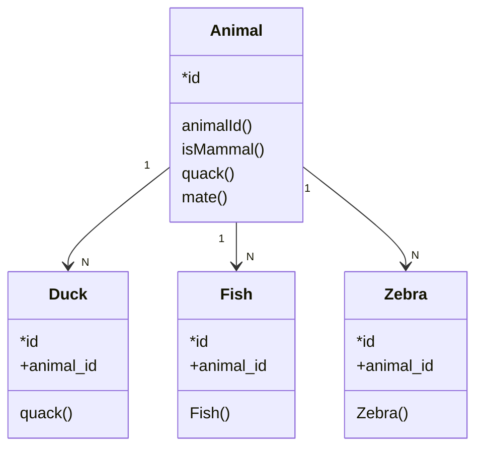

## Data Base Name

#### Relation Diagram 

#### Tables

| name                                  | type            | Details |
| ------------------------------------- | --------------- | ------- |
| [/TABLE_NAME](tables/tables_template) | temp, table ... |         |

## Dependencies

no se espesifica hasta el metodo

| Database | Server         | Schemes | Tables | permissions |
| -------- | -------------- | ------- | ------ | ----------- |
| Service  | Queue tracking | datas   | test   | 60000       |