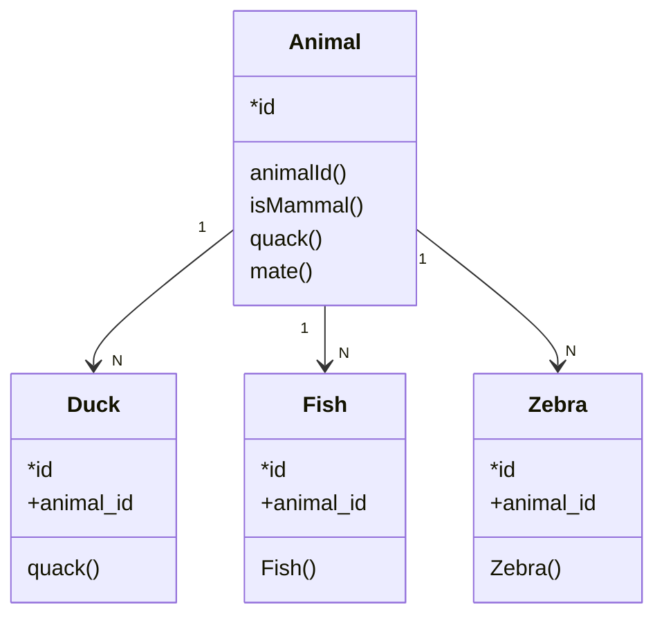

## Data Base Name

#### Relation Diagram 

#### Tables

| name                                  | type                      | Details |
| ------------------------------------- | ------------------------- | ------- |
| [/TABLE_NAME](tables/tables_template) | <temp or table or others> |         |

## Dependencies

In this section the dependencies of other tables, loading processes and dblinks are defined.

| Database | Server | Schemes | Tables | permissions         |
| -------- | ------ | ------- | ------ | ------------------- |
|          |        |         |        | read, write, create |
