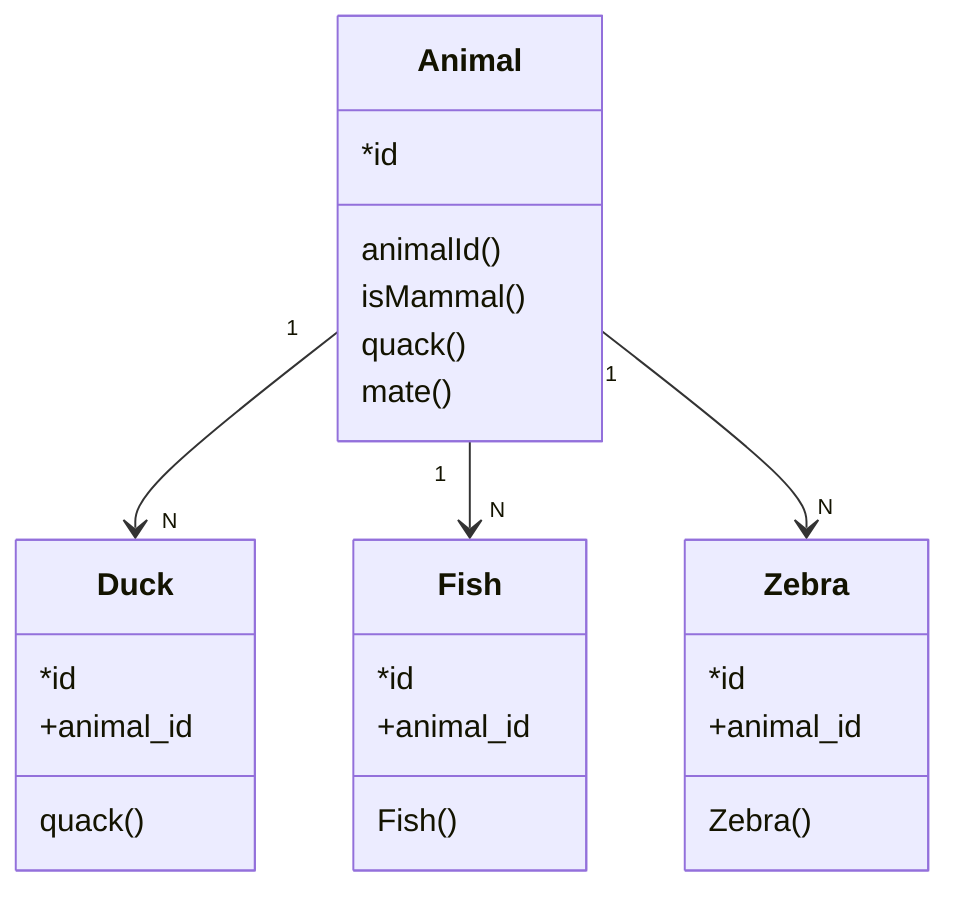

## Table Name

#### Relation Diagram 

##### Description

<The purpose of the table is defined.>

##### Constrains

| name | owner | type | condition |
| ---- | ----- | ---- | --------- |
|      |       |      |           |

##### Foreign Keys

| name | owner | refTable | type |
| ---- | ----- | -------- | ---- |
|      |       |          |      |

##### Indexes

| name | table | unique | tablespace |
| ---- | ----- | ------ | ---------- |
|      |       |        |            |

##### Triggers

| name | table | column | status |comment|
| ---- | ----- | ------ | ------ ||
|      |       |        |        ||

##### Attributes

| Column | Type|null?|length| comment |
| ------ | ----| | |----------- |
|        |     | | |            |

