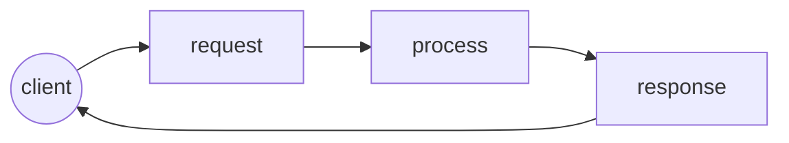
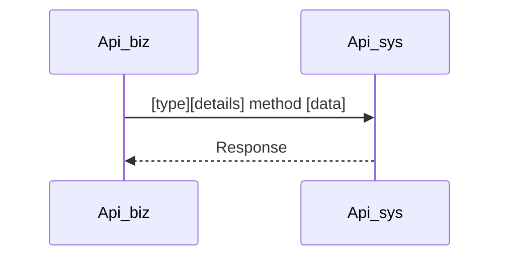

[TOC]

# /METHOD_NAME [GET/POST/PUT/PATH/DELETE]

<The purpose of the method is described.>


## Method Logic<A>



## Process sequence diagram<AD>


## Uses Cases

The internal use cases to the method are defined.

| Case                                | Type              | Unitary test status         | QA test Status              | comments or considerations |
| ----------------------------------- | ----------------- | --------------------------- | --------------------------- | -------------------------- |
| [1](usescases/usescase_template.md) | PRE/POST/REC/OTRO | successful, failed, stopped | successful, failed, stopped |                            |


## Request

This section defines all the possible data structures sent by the client when consuming the method. 


### URL

```http
https://example.com/api/v1/{example}/
```


### URL PARAMS

| name    | type   | description | required |
| ------- | ------ | ----------- | -------- |
| example | string |             | <Y or N> |


### Header

| name | value | description | required |
| ---- | ----- | ----------- | -------- |
|      |       |             | <Y or N> |


### Query Param

| name | type | description | required |
| ---- | ---- | ----------- | -------- |
|      |      |             | <Y or N> |


### Body

```json
{
	"test":12
}
```

###### Definitions

Each of the request parameters is detailed.

| name | type | description | required |
| ---- | ---- | ----------- | -------- |
|      |      |             | <Y or N> |


## Response 

In this section all the possible data structures received by the client at the moment of responding the method are defined. 


### Possible response success

This section defines all the possible data structures received by the client and that must be considered satisfactory at the time of responding to the method. 


#### [ 200 ]

<the objective of the response is described.>

```json
{
    "code":200,
    "message": "OK"
}
```

###### Definitions

Each of the request parameters is detailed.

| name | type | description | required |
| ---- | ---- | ----------- | -------- |
|      |      |             | <Y or N> |


#### [ 201 ]

<the objective of the response is described.>

```json
{
    "code":201,
    "message": "Created"
}
```

###### Definitions

Each of the request parameters is detailed.

| name | type | description | required |
| ---- | ---- | ----------- | -------- |
|      |      |             | <Y or N> |


#### [ 202 ]

<the objective of the response is described.>

```json
{
    "code":202,
    "message": "Accepted"
}
```

###### Definitions

Each of the request parameters is detailed.

| name | type | description | required |
| ---- | ---- | ----------- | -------- |
|      |      |             | <Y or N> |


### Possible response error

In this section all the possible data structures received by the client are defined and that must be considered as unsatisfactory when responding to the method.


#### [ 203 ]

<the objective of the response is described.>

```json
{
    "code":203,
    "message": "Non-Authoritative Information"
}
```


#### [ 204 ]

<the objective of the response is described.>

```json
{
    "code":204,
    "message": "No Content"
}
```


#### [ 400 ]

<the objective of the response is described.>

```json
{
    "code":400,
    "message": ""
}
```


#### [ 500 ]

<the objective of the response is described>

```json
{
    "code":500,
    "message": ""
}
```


#### [ 600 ]

<the objective of the response is described.>

```json
{
    "code":600,
    "message": ""
}
```


## Administration and data management 

In this section you define all the transformations, temporary and final repositories of the data within the method flow.


### Transformation Request <A>

In this section the matrix of all the data transformations that is carried out within the service is defined. 

| Original Payload<A> | Mulesoft<D> | <destiny> transformation<A> |
| :------------------ | :---------- | :-------------------------- |
|                     |             |                             |


### Database dependencies <AD>

This section defines all the connections to databases and queries that are used. 

#### <name_database>

| name     | value                                   |
| -------- | --------------------------------------- |
| Type     | oracle, mssql, mariadb, mongo, postgres |
| Protocol | JDBC, ODBC                              |
| Host     | 0.0.0.0                                 |
| Port     | 1521                                    |
| Instance | Example                                 |
| Schema   | Example                                 |
| DBlink   | Name                                    |
| Tables   | Example1, Example2,                     |

###### Select

<The objective of the query is described.>

```sql
select * from
```

###### Insert

<The objective of the query is described.>

```sql
Insert from
```

###### Update

<The objective of the query is described.>

```sql
update * from
```

###### Delete

<The objective of the query is described.>

```sql
delete * from
```


### Services dependencies

This section defines all the connections to the web services and the methods that are used within the method.

###### <Service_name>

| Method<A> | Type<A> |
| --------- | ------- |
| /method   | GET     |
| /method   | POST    |


### Queue dependencies

This section defines all the connections to the queue servers and instances that are used. 

###### <queue_name>

| name          | value        |
| ------------- | ------------ |
| queue_payment | array object |

