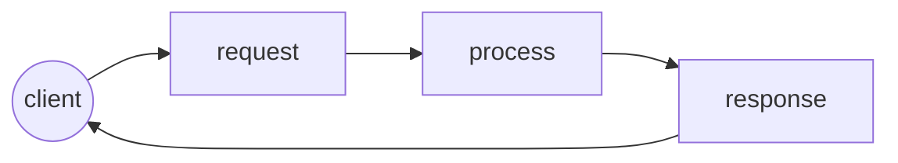
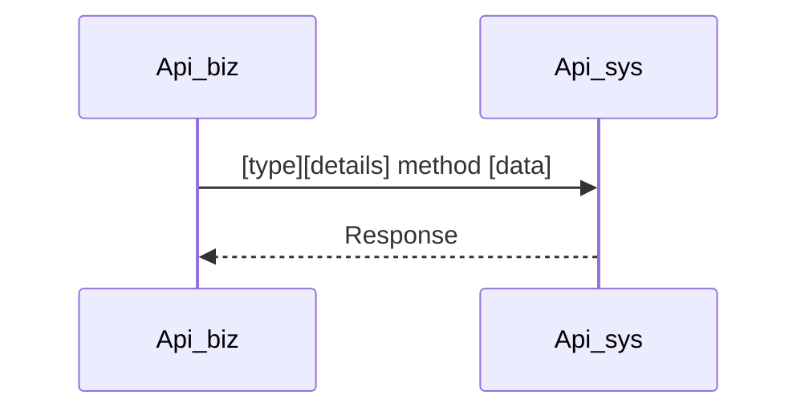

## /METHOD_NAME [GET/POST/PUT/PATH/DELETE]

Details

##### Method Logic



##### Process sequence diagram


##### URL

```http
https://data.com/api/v1/{account}/
```

###### URL Param
Se definen las cabeceras del request a utilizar.
| name | value | description | required |
| ---- | ----- | ----------- | -------- |
|      |       |             | Y or N   |

##### Header

Se definen las cabeceras del request a utilizar.

| name | value | description | required |
| ---- | ----- | ----------- | -------- |
|      |       |             | Y or N   |


##### Query Param

Se definen query param del request a utilizar.

| name | type | description | required |
| ---- | ---- | ----------- | -------- |
|      |      |             | Y or N   |


##### Request

Se definen la estructura del request utilizada.

```json
{
"test":12
}
```

###### Details

Se detalla cada uno de los parámetros del request.

| name | type | description | required |
| ---- | ---- | ----------- | -------- |
|      |      |             | Y or N   |


##### Response

Se definen y detalla los http codes de respuesta utilizados.

###### 200

Respuesta estándar para solicitudes HTTP correctas. La respuesta real dependerá del método de solicitud utilizado. En una solicitud GET, la respuesta contendrá una entidad correspondiente al recurso solicitado. En una solicitud POST, la respuesta contendrá una entidad que describa o contenga el resultado de la acción.

```json
{
    "code":200,
    "message": "OK"
}
```

###### Details body

Se detalla cada uno de los parámetros del request.

| name | type | description | required |
| ---- | ---- | ----------- | -------- |
|      |      |             | Y or N   |


###### 201

La solicitud se ha cumplido, lo que da como resultado la creación de un nuevo recurso.

```json
{
    "code":201,
    "message": "Created"
}
```

###### 202

La solicitud se ha aceptado para su procesamiento, pero el procesamiento no se ha completado. La solicitud puede o no ser actuada finalmente, y puede ser desautorización cuando se produce el procesamiento.

```json
{
    "code":202,
    "message": "Accepted"
}
```

###### 203

El servidor es un proxy y devuelve una versión modificada de la respuesta del origen.

```json
{
    "code":203,
    "message": "Non-Authoritative Information"
}
```

###### 204

El servidor procesó correctamente la solicitud y no devuelve ningún contenido.

```json
{
    "code":204,
    "message": "No Content"
}
```

###### 400

```json
{
    "code":400,
    "message": ""
}
```

###### 500

```json
{
    "code":500,
    "message": ""
}
```

###### 600

```json
{
    "code":600,
    "message": ""
}
```


##### Database dependencies

Se definen las conexiones a bases de datos y querys que son utilizados.

###### name_database

| name     | value                                   |
| -------- | --------------------------------------- |
| Type     | oracle, mssql, mariadb, mongo, postgres |
| Protocol | JDBC, ODBC                              |
| Host     | 0.0.0.0                                 |
| Port     | 1521                                    |
| Instance | Example                                 |
| Schema   | Example                                 |
| DBlink   | Name                                    |
| Tables   | Example1, Example2,                     |

```sql
select * from
```

```sql
update * from
```

```sql
delete * from
```


##### Services dependencies

Se definen las las conexiones a servicios web y que metodos son utilizados.

###### Service_name

| name    | value    |
| ------- | -------- |
| Methods | /example |
|         | /example |


##### Queue dependencies

Se definen las las conexiones a servidores de cola y que instancias son utilizados.

###### queue_name

| name | value |
| ---- | ----- |
|      |       |
